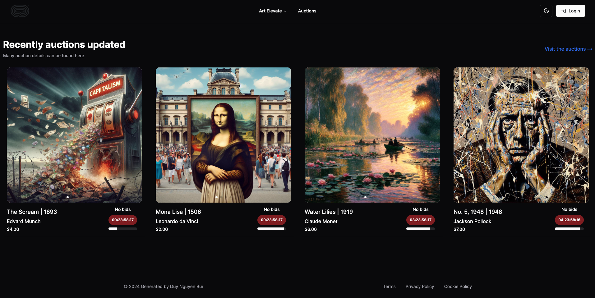
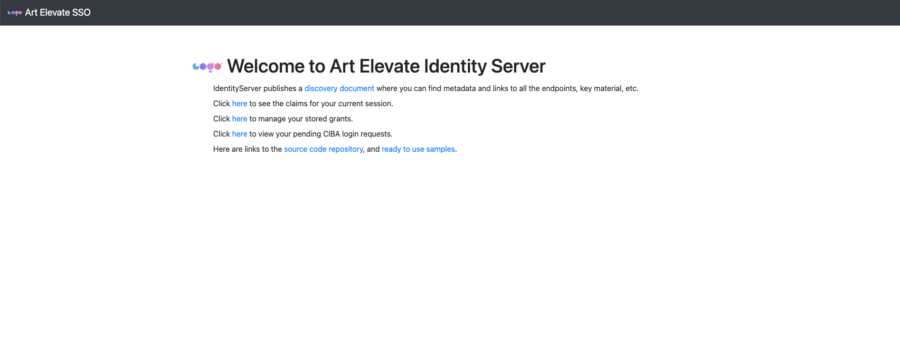
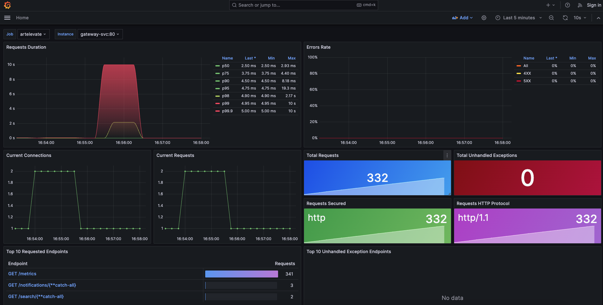
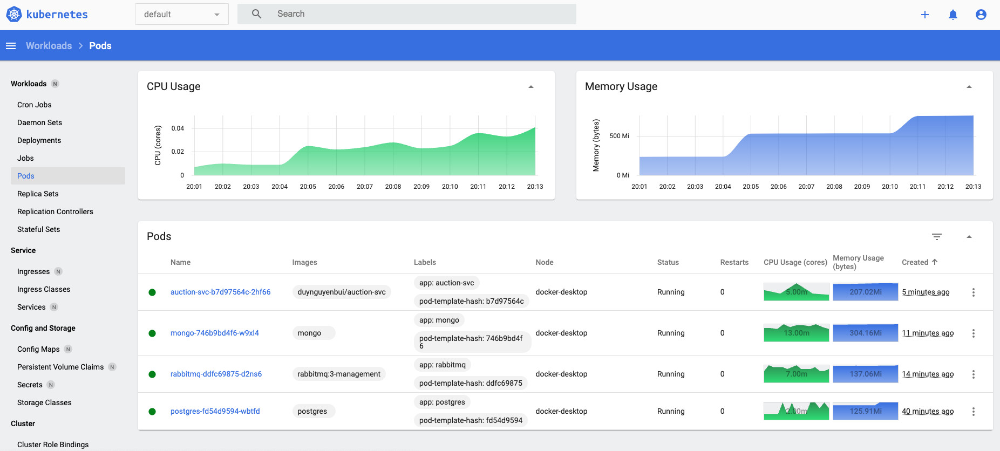

# artShop Reference Application - "Art Elevate"
A reference .NET application implementing an art work auction web site using a services-based architecture.
## Real-time Art Work Auction Webiste Using Services-based Architecture

### Frameworks and Technologies:

- **Frameworks:**
  - [Next.js 14](https://nextjs.org/)
  - [.NET 8](https://dotnet.microsoft.com/)

- **Technologies:**
  - Utilizing a [three-tier architecture](https://www.ibm.com/topics/three-tier-architecture) for each service
  - Web Socket [(SignalR)](https://dotnet.microsoft.com/apps/aspnet/real-time)
  - Message Broker [RabbitMQ](https://www.rabbitmq.com/)
  - [Nginx](https://nginx.org/) server and [Yarp](https://github.com/microsoft/reverse-proxy) gateway
  - [gRPC](https://grpc.io/) to enhance performance
  - [Entity Framework Core](https://docs.microsoft.com/en-us/ef/core/)
  - JWT Token using [NextAuth](https://next-auth.js.org/) and [Duende Identity Server](https://duendesoftware.com/products/identityserver)
  - [Tailwind CSS](https://tailwindcss.com/) for the user interface (Shadcn/ui)

### Testing and Deployment:

- Unit Testing and Integration Testing using [xUnit](https://xunit.net/) and [WebFactory](https://learn.microsoft.com/en-us/aspnet/core/test/integration-tests?view=aspnetcore-7.0)
- Utilization of [Docker](https://www.docker.com/)/[Kubernetes](https://kubernetes.io/) for building, managing, and deploying

### Prerequisites

- Clone the eShop repository: https://github.com/duynguyenbui/artelevate
- Nodejs latest [Node 20](https://nodejs.org/en)
- Install the latest [.NET 8 SDK](https://github.com/dotnet/installer#installers-and-binaries)
- Install your model with using local or openai model
- Install & start Docker Desktop:  https://docs.docker.com/engine/install/

### Contributing

For more information on contributing to this repo, please contact with me [Duy Nguyen Bui](https://www.facebook.com/duynguyenn.bui).

#### Nextjs
  

#### Duende Identity Server
  

#### Prometheus - Grafana
  

#### Kubernetes
  
